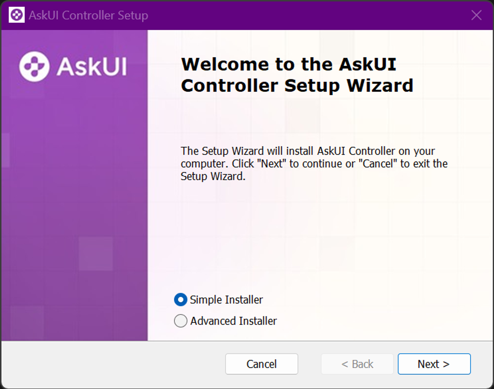
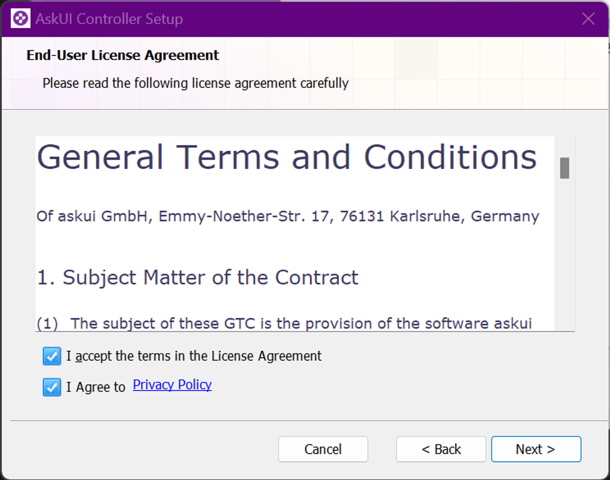
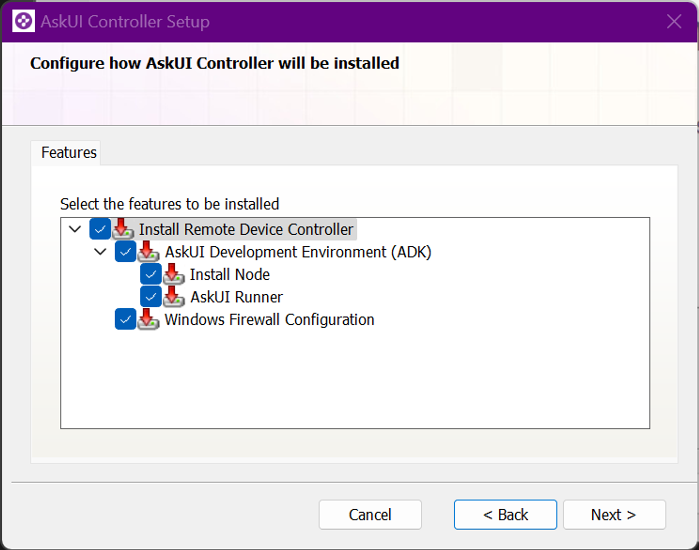
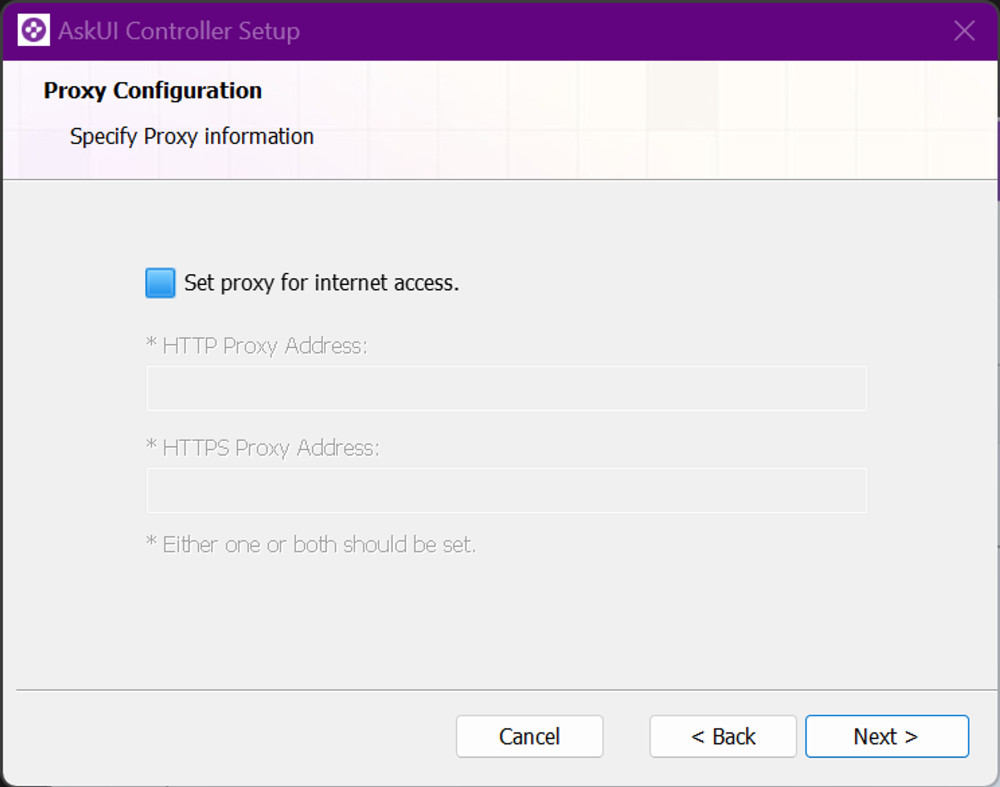
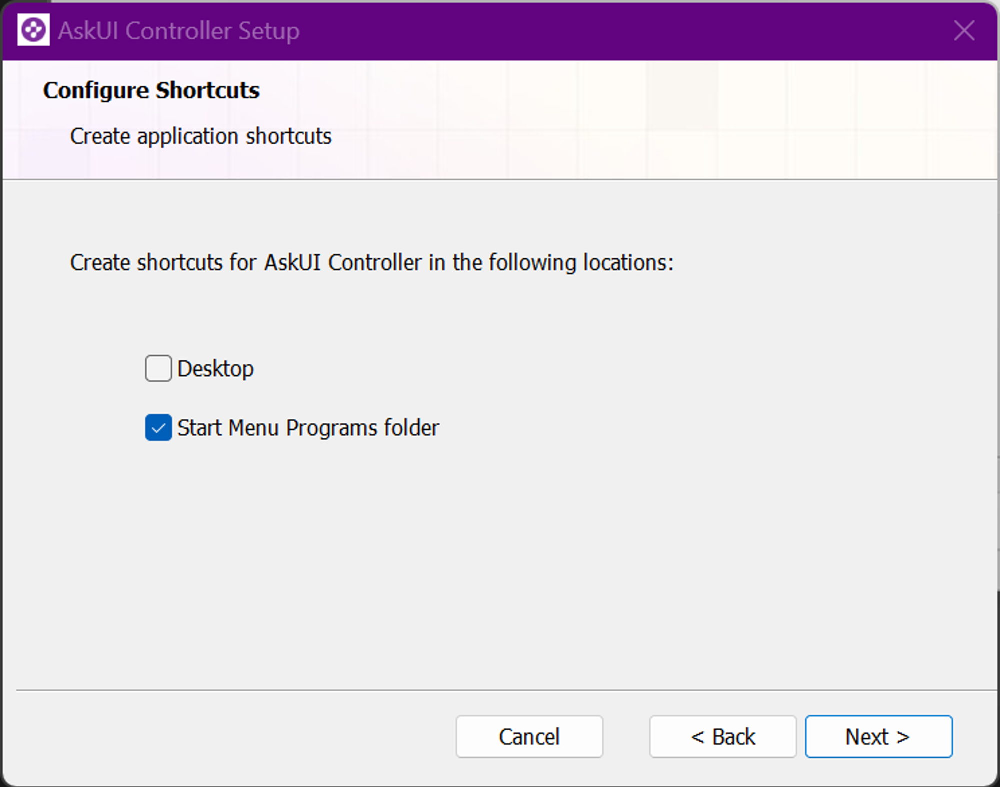
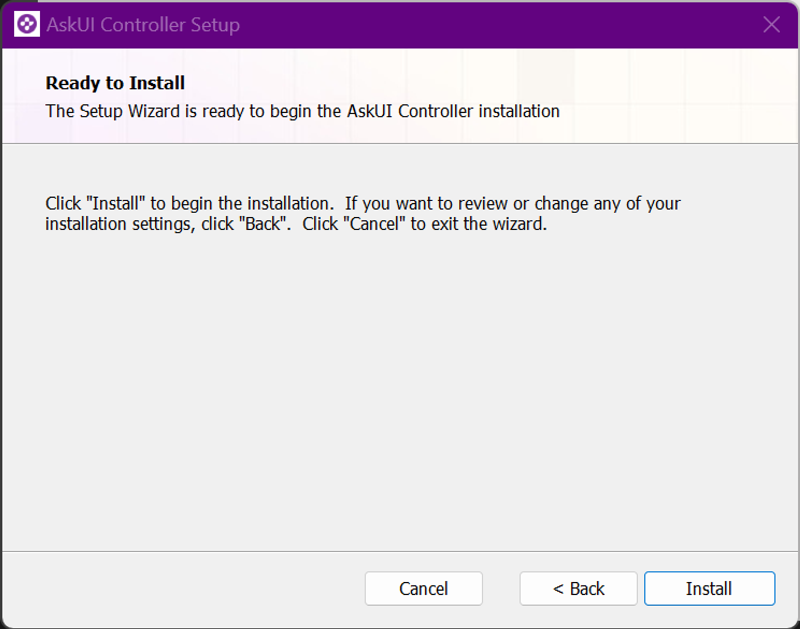
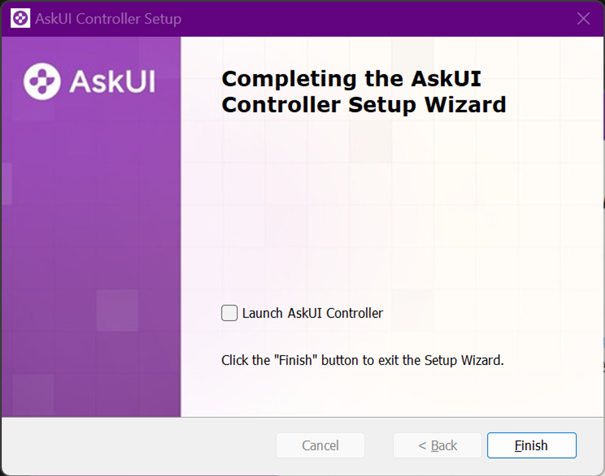

# AskUI-Installer
The AskUI-Installer guides you through installing the necessary AskUI components for your system (Currently only Windows).

It will install the following components:

* AskUI Development Environment (ADE)
* AskUI Development Kit (SDK)
* (optional) [AskUI-Runner (Executing workflows from AskUI Studio)](AskUI-Runner.md)

[Download here 🤖](https://files.askui.com/releases/Installer/24.01.01/askui-full-installer.exe)

## Prerequisites

* Administrator privileges on your machine

## Installation via UI
Upon launching the executable, you will engage with a series of dialogs for the installation process.

### Welcome Dialog
In this initial step, you can choose their preferred installer mode:

- **Simple Installer:** Installs default components without any configuration.
- **Advanced Installer:** Provides you with the option to select specific components and configure settings, such as proxy addresses.



### License Agreement
You must accept the terms in the license agreement and agree to the privacy policy before proceeding with the installation.



### Installation Folder
You can choose the installation folder for the application.


### Advanced Mode Dialog
The following dialogs are displayed only if you opt for the **Advanced Mode**.

#### Configure Components
You can choose which components you want to install additionally to the **Remote Device Controller**.



#### Proxy Configuration 
This dialog is shown only if the **Advanced Mode** includes the installation of _ADE_. You can set up internet access proxies, which will become part of the default AskUI settings.



#### Shortcuts
You can set preferences for shortcuts.



#### Start Menu Shortcuts Folder
This dialog appears when _Start Menu Programs folder_ was selected in the previous dialog.


### Start Installation
Now you are ready to start the installation.



### Installation Completed
You receive confirmation that the installation is successfully completed. You can select to start the Remote Device Controller if you want to use AskUI immediately.



## Installation via Console (Silent Mode)
Use the downloaded executable file (**.exe**) for silent installation, which allows you to choose the installation directory and components. To install silently, run the following command in the command line **CMD** with Administrator privileges:

```shell
"<installer_path>" /qn
```

**Options:**

- **`/l*v "<log_file_path>"`**: Set the installer log file path.
- **`APPDIR="<installation_directory>"`**: Specify the installation directory.
- **`INSTALL_ADK="NO"`**: Skip AskUI Development Environment installation.
    - **`INSTALL_NODE="NO"`**: Skip Isolated Node environment installation.
    - **`INSTALL_ASKUI_RUNNER="NO"`**: Skip AskUI Runner installation.
    - **`HTTP_ADDRESS="<proxy_http_address>"`**: Set the HTTP proxy address.
    - **`HTTPS_ADDRESS="<proxy_https_address>"`**: Set the HTTPS proxy address.
- **`CONFIGURE_WINDOWS_FIREWALL="NO"`**: Skip Windows Firewall configuration.

### Example
This command installs all components silently and sets the HTTP proxy address to http://proxy.example.com:

```shell
"<installer_path>" /qn HTTP_ADDRESS="http://proxy.example.com"
```
